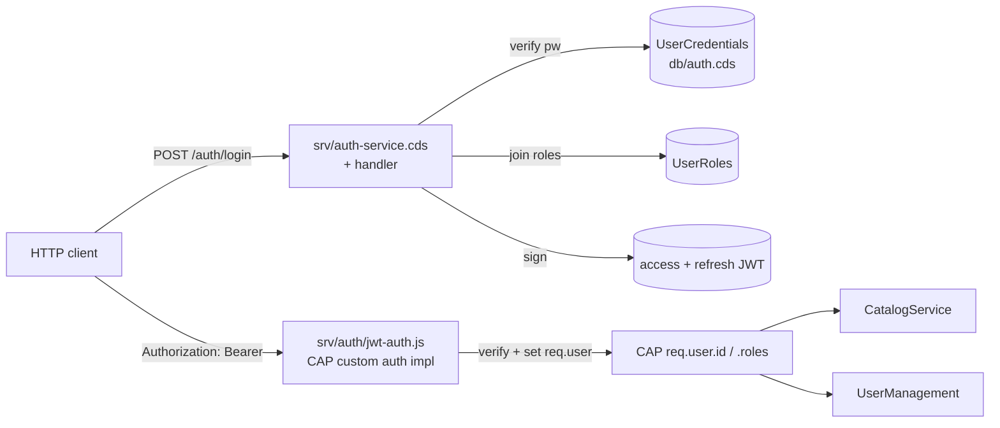

# JWT Authentication for CAP Service (no XSUAA)

## Context

The CAP service today runs with `auth.restrict_all_services: false` and no `@requires` / `@restrict` annotations — every endpoint is effectively public. The existing data model already has `Users`, `Roles`, and `UserRoles` (db/schema.cds:84, db/schema.cds:105, db/common.cds:23), but no credentials field and no auth pipeline.

We want service-level authentication using JWT (signed locally with a shared secret) so the same `@requires` / `@restrict` machinery from `1_anubhav_spec_srv.md` keeps working as we add it later, without binding to XSUAA. The user explicitly required that **no existing entity be modified**, so credentials live in a brand-new sibling CDS file.

Outcome: callers hit `POST /auth/login` with login + password, get an access token + refresh token, and pass `Authorization: Bearer <token>` to existing OData services. CAP's `req.user` is populated (`id`, `roles`) by a custom auth implementation so `@restrict ... to: 'Admin'` and `where: 'userID = $user'` work natively when added.

## Shape of the change

The two new vertical slices — **auth service** (issues tokens) and **auth middleware** (consumes tokens) — share one helper `srv/auth/jwt.js` for sign/verify, and one helper `srv/auth/password.js` for bcrypt.

## Files to add

| File | Purpose |
|------|---------|
| `db/auth.cds` | New `UserCredentials` entity with `user` Association→Users, `passwordHash`, `passwordSalt` (unused with bcrypt but kept simple → drop), `failedAttempts`, `lastLoginAt`. Same namespace `anubhav.claude`. |
| `db/data/anubhav.claude-UserCredentials.csv` | Seed bcrypt hashes for the 12 seeded users so local dev works out of the box. Default dev password: `Welcome1!`. |
| `srv/auth-service.cds` | New unrestricted service `AuthService @(path: 'auth')` exposing three unbound actions: `login(loginName, password)`, `refresh(refreshToken)`, and `me()` plus a bare `Users` projection if needed for `me`. Mark service `@requires: 'any'` so it's reachable pre-auth. |
| `srv/auth-service.js` | Wires handler. Same one-liner shape as `srv/cat-service.js:4`. |
| `srv/handlers/auth.handler.js` | Implements `login`, `refresh`, `me`. Uses CDS `SELECT` against `UserCredentials`, `Users`, `UserRoles`; calls `password.compare` and `jwt.sign`. |
| `srv/auth/jwt.js` | `sign({sub, roles}, kind)` and `verify(token, kind)` wrapping `jsonwebtoken`. Reads secret + TTLs from env (`AUTH_JWT_SECRET`, `AUTH_ACCESS_TTL=15m`, `AUTH_REFRESH_TTL=7d`). Different `aud` claim per kind (`access` vs `refresh`) to prevent cross-use. |
| `srv/auth/password.js` | `hash(plain)` and `compare(plain, hash)` wrapping `bcryptjs`. |
| `srv/auth/jwt-auth.js` | CAP custom auth impl: express-style middleware. Reads `Authorization: Bearer`, calls `jwt.verify` with `aud: 'access'`, looks up roles, sets `req.user = new cds.User({ id, roles })`. On missing header → leaves user as `cds.User.anonymous` (CAP will 401 only where `@requires` demands). On bad/expired token → respond `401`. |

## Files to modify (minimal, no entity changes)

| File | Change |
|------|--------|
| `package.json` | Add deps `jsonwebtoken@^9` and `bcryptjs@^2`. Replace `auth.restrict_all_services` block with `auth: { kind: 'custom', impl: './srv/auth/jwt-auth.js' }`. Leave the rest untouched. |
| `.gitignore` | (no change needed) |
| `srv/cat-service.cds`, `srv/user-management.cds`, `db/schema.cds`, `db/common.cds` | **Untouched.** Per the constraint. Adding `@requires` / `@restrict` is intentionally out of scope of this PR so the existing model is not disturbed. |

## Implementation order

1. **Add deps & wire custom auth in `package.json`** — once `auth.kind=custom` points at a file that doesn't exist yet, `cds watch` will crash, so create `srv/auth/jwt-auth.js` as a no-op stub in the same commit.
2. **`db/auth.cds` + CSV seed.** Bcrypt-hash `Welcome1!` once (cost 10) and use the same hash for all 12 rows in the CSV — that's safe for local dev and avoids shipping a script the user has to run. Document the password in a `README` snippet inside the handler comments — no, drop that, just put it in the PR description.
3. **`srv/auth/password.js`** — wraps `bcryptjs.hash`/`compare`. Trivial.
4. **`srv/auth/jwt.js`** — `sign(payload, 'access' | 'refresh')` picks TTL + audience from env; `verify(token, kind)` enforces audience. Throw on failure; caller maps to HTTP code.
5. **`srv/auth/jwt-auth.js`** — flesh out the stub:
   - If no `Authorization` header → `req.user = new cds.User.Anonymous()` and `next()`.
   - If header present but verify fails → `res.status(401).json({ error: 'invalid_token' })`.
   - On success → load roles via `SELECT UserRoles.role_code WHERE user_ID = sub`, set `req.user = new cds.User({ id: sub, roles })`.
   - Export the middleware as `module.exports = function (req, res, next) { ... }` — that's the contract CAP's custom-auth kind expects.
6. **`srv/auth-service.cds`** — service definition. Use unbound actions (not functions) for login/refresh because they have side effects (`lastLoginAt`, attempt counters). `me` returns the current user record with roles expanded — implement as a function.
7. **`srv/handlers/auth.handler.js`** — three handlers:
   - `login`: lookup `Users` by `loginName` + `isLocked=false`, lookup `UserCredentials` by `user_ID`, `bcrypt.compare`, on success update `lastLoginAt` + reset `failedAttempts`, on fail increment counter and `req.error(401,'Invalid credentials')`. Return `{ access, refresh, expiresIn }`.
   - `refresh`: `jwt.verify(token, 'refresh')`, reload roles fresh from DB, issue new access (and rotate refresh). Reject if user is now locked.
   - `me`: read `req.user.id`, return `{ id, loginName, firstName, lastName, roles: [...] }` by selecting `Users` + `UserRoles`.
8. **`srv/auth-service.js`** — one-liner that delegates to `./handlers/auth.handler`.

## Reuse / patterns honored

- Generic handler pattern from `1_anubhav_spec_srv.md` §4.2 and existing `srv/handlers/user-management.handler.js`.
- Same CSV naming convention as `db/data/anubhav.claude-Users.csv` etc.
- `srv/cat-service.js:4` style for `srv/auth-service.js`.
- Namespace `anubhav.claude` reused in `db/auth.cds` to match every other CDS file.
- `cds.User` from `@sap/cds` is the existing abstraction — we set it; we do not invent our own.

## Trickier details to get right

- **Custom-auth shape in @sap/cds v9.** Export the middleware as `module.exports = (req, res, next) => {...}`. Set `req.user = new cds.User({ id, roles })` (object form) — that's what makes `$user` in `@restrict where` work later. Anonymous case must still call `next()`; do **not** 401 there or the auth-service login endpoint becomes unreachable.
- **Auth-service must be reachable pre-auth.** Annotate it with `@(requires: 'any')` so it bypasses the global auth requirement, even after we eventually add `@requires` elsewhere.
- **Token audience separation.** Access tokens carry `aud: 'access'`; refresh tokens `aud: 'refresh'`. Middleware rejects anything that isn't `aud: 'access'`. Otherwise a refresh token could be replayed as an access token for its full lifetime.
- **Roles freshness.** Load roles from the DB on every request (not from the token), so admin revocation takes effect immediately. The JWT `sub` is the only trusted claim from the token.
- **Locked users.** `login` and `refresh` both check `Users.isLocked` and reject 403. The middleware does **not** check `isLocked` per request — that would double the cost of every API call; we accept up to access-token-TTL stale on lock (15 min).
- **Secret bootstrap.** If `AUTH_JWT_SECRET` is unset, generate a random one at startup and log a warning. Crash in prod (`NODE_ENV=production`). Avoids accidental "auth works in dev but everyone shares secret in prod".

## Verification

End-to-end smoke (after `npm install` and `cds watch`):

1. `curl -X POST http://localhost:4004/odata/v4/auth/login -H 'Content-Type: application/json' -d '{"loginName":"superadmin@anubhav.com","password":"Welcome1!"}'` → 200 with `access`, `refresh`, `expiresIn`. Wrong password → 401.
2. `curl http://localhost:4004/odata/v4/catalog/Travellers -H "Authorization: Bearer $ACCESS"` → 200 with rows (still no `@restrict` so every authenticated user sees all — that's expected; restrict wiring is a separate task).
3. Same call without header → also 200 today (auth-not-required not enforced); after we later set `@requires: 'authenticated-user'` on services it'll 401. Out of scope for this PR but verify the path is wired by adding a temporary `@requires: 'authenticated-user'` on `CatalogService` locally and confirming 401 vs 200.
4. `curl http://localhost:4004/odata/v4/auth/me -H "Authorization: Bearer $ACCESS"` → 200 with `{id, loginName, roles:['ADMIN']}` for the superadmin token.
5. `curl -X POST http://localhost:4004/odata/v4/auth/refresh -H 'Content-Type: application/json' -d "{\"refreshToken\":\"$REFRESH\"}"` → 200 with new pair.
6. Pass refresh token as a bearer to `/me` → 401 (audience check works).
7. `node -e "console.log(require('jsonwebtoken').sign({sub:'x',aud:'access'},'wrong'))"` then use that token → 401 (signature check works).
8. Verify existing entities still load: `curl http://localhost:4004/odata/v4/catalog/Destinations` returns the seeded rows unchanged.

## Out of scope (call out in PR description)

- Adding `@requires` / `@restrict` annotations to `CatalogService` / `UserManagement`. The plumbing this PR adds makes that a one-CDS-file follow-up that does not require touching entities.
- Refresh-token rotation persistence / revocation list. Stateless JWT for now.
- Rate limiting on `/auth/login`.
- Password reset flow (the existing `resetPassword` action in `user-management.handler.js:46` will need a follow-up to actually write the hash — currently it's a no-op).